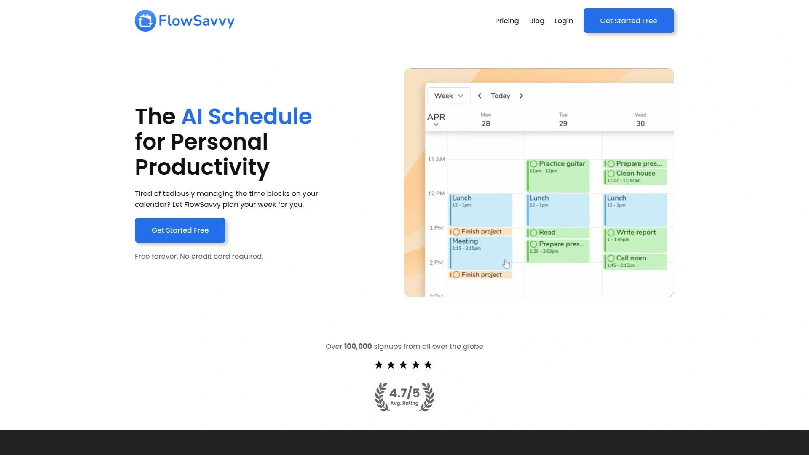
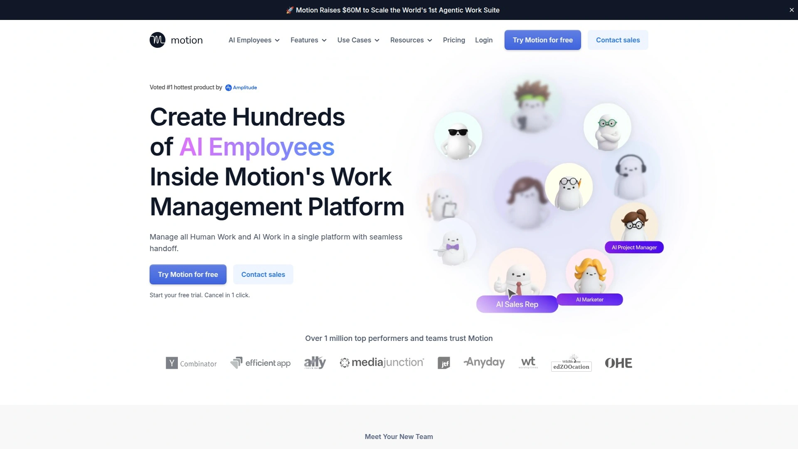
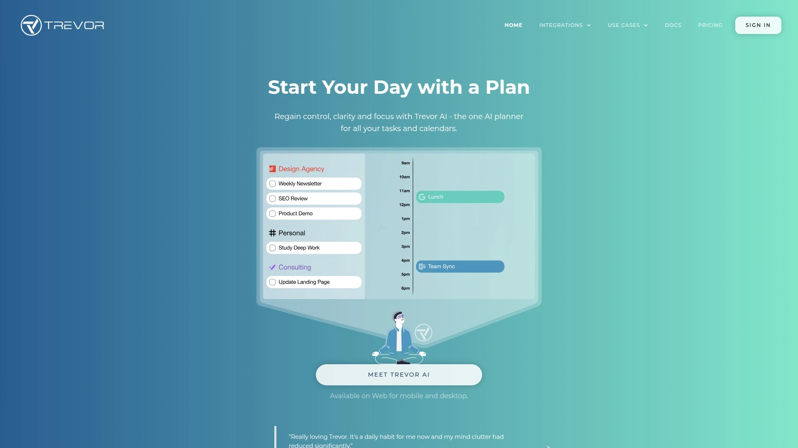
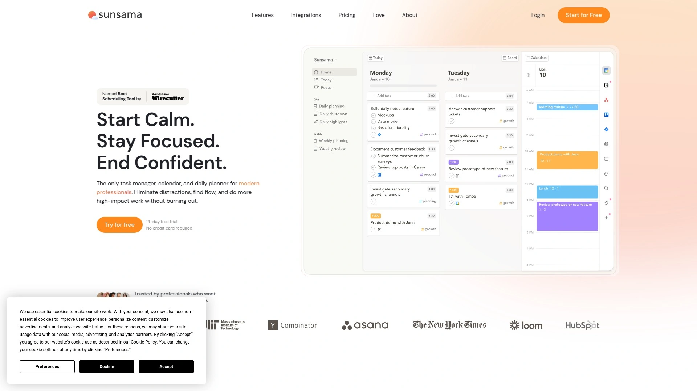
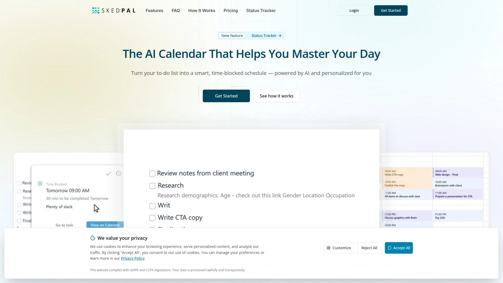
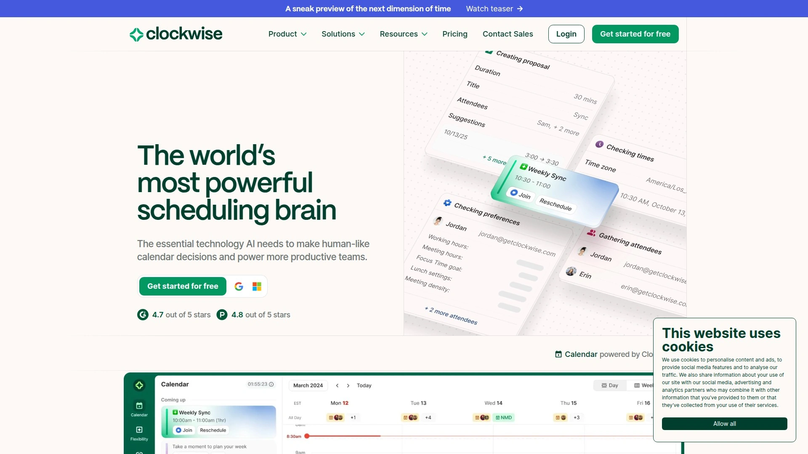
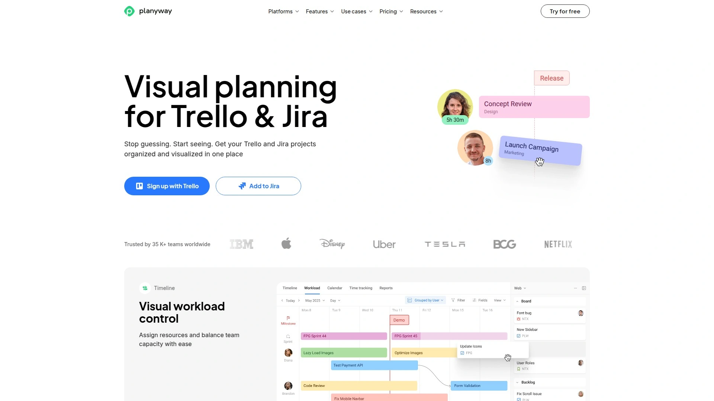

# No More Calendar Chaos! Recommend 9 AI Scheduling Game-Changers!

Your calendar looks like someone threw darts at it blindfolded. Meetings stack on top of tasks, your to-do list lives in three different apps, and you spend 30 minutes every morning just figuring out what to tackle first instead of actually doing anything productive. AI-powered auto-scheduling tools fix this by automatically placing your tasks on your calendar, rescheduling conflicts when life happens, and building time-blocked schedules that actually reflect how humans work.

The right scheduling assistant eliminates manual calendar Tetris, reduces mental overhead from constantly replanning your day, and creates realistic schedules that account for your energy levels and work patterns. These platforms range from free forever options to premium productivity suites costing $30+ monthly, each handling calendar management differently—some focus purely on task auto-scheduling, others optimize team calendars, and a few guide you through daily planning rituals. Below are nine AI scheduling tools ranked by their overall value for individuals and teams drowning in calendar chaos.

***

## **[FlowSavvy](https://flowsavvy.app)**

Free forever auto-scheduler that instantly creates your perfect week without credit cards or complexity.

FlowSavvy handles the tedious work of managing time blocks on your calendar by automatically planning your entire week for you. You just tell it what you need to do, and it spits out a game plan showing exactly when to work on each task. Over 100,000 people worldwide have signed up, drawn by the promise of getting more done faster while actually having more downtime.

Change of plans? No problem—FlowSavvy automatically reschedules your tasks whenever you make changes, eliminating the manual rearranging nightmare that wastes hours each week. The platform intelligently plans time for recurring activities like workouts, language lessons, and hobbies while making sure you never miss important deadlines. Automatic color coding visualizes your workload by showing how close tasks are to due dates, letting you immediately see how your week will play out and whether you're overcommitting.

What separates FlowSavvy from competitors is the combination of powerful features with a simple interface—auto-scheduling doesn't feel like piloting a spaceship. You stay in complete control by dragging and dropping auto-scheduled tasks to lock them in place whenever you want. Custom scheduling hours let you define when FlowSavvy should schedule tasks, whether that's work hours, personal time, mornings, evenings, or any combination.

The platform syncs with Google Calendar, iCloud, and Outlook, automatically scheduling around your existing events. Fully-featured web, iOS, and Android apps mean you can use FlowSavvy anywhere without losing functionality. Filter your to-do list by calendar and tag to quickly manage tasks across different life areas. The free forever model with no credit card required makes FlowSavvy the most accessible option for anyone wanting automatic scheduling without monthly fees or trial gimmicks.

Best for: Anyone drowning in tasks who wants instant automated scheduling without paying monthly fees or dealing with complicated setup.

***

## **[Motion](https://www.usemotion.com)**

Premium AI productivity suite claiming to save users 30.3 days per year through intelligent auto-scheduling.

Motion combines calendar, task management, project tracking, and meeting scheduling into one AI-driven platform that automatically builds your daily schedule. The system prioritizes tasks based on deadlines and importance, reprioritizes unfinished work, selects ideal meeting times, and balances workloads across your team. This all-in-one approach eliminates switching between separate calendar, to-do list, and project management tools.

The AI engine continuously analyzes your calendar, tasks, and projects to make real-time adjustments ensuring everything stays prioritized and organized. When something unexpected pops up, Motion automatically reschedules affected tasks to the next best time without you lifting a finger. Time blocking happens intelligently, protecting deep work periods by limiting unnecessary distractions and maintaining healthy work-life balance.

Motion's project manager automates task prioritization, workload balancing, and project tracking with Gantt charts that provide dynamic real-time timeline views. As team members complete tasks, projects advance automatically, reducing manual updates and status meetings. The system predicts project completion dates and alerts you if deadlines are at risk, preventing surprises.

Used by over 1 million busy professionals and teams, Motion earns praise for its sophisticated automation but faces criticism for its steep $34/month individual pricing ($19/month annual). The platform excels at automatic task prioritization and calendar integration, making it particularly valuable for busy professionals juggling multiple projects. However, it lacks comprehensive project management features that complex teams might need. The 7-day free trial lets you test whether Motion's bold time-saving claims hold up for your workflow.

Best for: Busy professionals and small teams willing to pay premium pricing for comprehensive automated scheduling and project coordination.

***

## **[Reclaim AI](https://reclaim.ai)**

Free Google Calendar AI that auto-schedules tasks, habits, meetings, and breaks to reclaim 40% of your workweek.

Reclaim AI transforms static Google Calendar and Outlook Calendar into intelligent scheduling machines that flexibly defend your time while prioritizing focus and collaboration. The platform automatically finds the best time for focus work, meetings, tasks, habits, and breaks based on your priorities. If conflicts arise—vacation time, urgent meetings, or high-priority tasks—events automatically reschedule to the next optimal slot.

Over 60,000 companies trust Reclaim to create more time for what matters, drawn by the generous free tier and powerful automation. Focus Time uses AI to protect flexible time blocks for deep work when your calendar allows. Tasks auto-schedule directly in your calendar with two-way sync from Google Tasks, Asana, Todoist, ClickUp, Jira, and Linear. Habits flexibly defend time for routines like lunch, exercise, or learning without creating rigid blocks that conflict with dynamic work schedules.

Smart Meetings schedule at the best time for all attendees, while scheduling links share your availability with AI-powered intelligence. Calendar Sync blocks availability across multiple calendars, crucial for people juggling work and personal commitments. Buffer Time automatically schedules breaks and travel between events, and Color Coding tags events by type for visual clarity.

No-Meeting Days protect entire days for heads-down work, and time tracking analyzes where your hours actually go. Slack integration keeps your status synced with calendar activities. The platform earned Kevin Stratvert's endorsement as "the AI time management app I wish I had 10 years ago" for its ability to automate time blocking and timeboxing. Reclaim offers an extended 30-day trial for premium features, with the free plan covering most individual needs.

Best for: Teams and individuals using Google Calendar or Outlook who want comprehensive free automation without monthly costs.

***

## **[Trevor AI](https://www.trevorai.com)**

Daily task planner that turns chaotic to-do lists into actionable time-blocked schedules using intelligent AI.

Trevor AI specializes in transforming tasks into scheduled plans through intelligent time blocking technology. The platform helps you plan your day with clarity by integrating with existing calendar accounts and syncing both ways in real-time with services like Todoist. Drag-and-drop scheduling lets you visually organize tasks by dropping them from your to-do list directly into calendar time slots.

The AI automatically estimates task duration based on your personal model that improves over time, learning how long you typically take for different types of work. Smart scheduling suggestions order tasks based on urgency and importance, ensuring high-priority items get tackled first. Third-party integrations with Google Calendar, Outlook, and popular task managers create a unified view of all your commitments.

Flexible recurring tasks let you schedule daily, weekly, or custom patterns for habits and routines without rigid time requirements. The event menu for scheduled tasks includes a beautiful timer and occasional AI-generated action plans to help you focus on the work at hand while everything else blurs into the background. Scheduling a task into your timeline primes your mind for action by assigning specific time frames, making it easier to maintain single-task focus.

Trevor AI tracks overdue tasks and helps you reschedule them intelligently rather than letting them pile up indefinitely. The smart scheduling queue adds individual tasks or entire lists to get prioritized suggestions for when to work on each item. The web-based platform works seamlessly across desktop and mobile, syncing your schedule without data loss or functionality limitations. Pricing stays accessible compared to premium competitors, with free and paid tiers available.

Best for: Visual thinkers who want intuitive drag-and-drop time blocking with smart AI suggestions for task prioritization.

***

## **[Sunsama](https://www.sunsama.com)**

Premium daily planner combining guided rituals, unified task views, and timeboxing for calm, sustainable productivity.

Sunsama positions itself as the only task manager, calendar, and daily planner built specifically for modern professionals who want to eliminate distractions and find flow without burning out. The platform's guided daily planning workflow walks you through intentional decisions about how to spend your time using a step-by-step routine. This structured approach prevents the chaos of jumping between apps and randomly reacting to whatever screams loudest.

The unified daily view pulls tasks from Trello, Asana, ClickUp, Github, Jira, Linear, Monday, Notion, and Todoist, plus emails from Gmail and Outlook, plus meetings from your calendars—all in one interface. Imported tasks stay in sync, with Sunsama automatically updating your other tools when you check items off or modify them. You can turn Slack and Teams messages into tasks for follow-up without feeling like everything demands urgent attention.

Timeboxing encourages realistic daily goals by estimating task duration and scheduling work to your calendar, helping you end work days at reasonable times. Focus mode creates a minimalistic screen showing only your current task and subtasks, eliminating distractions when deep work matters. Weekly review and planning features make you intentional about weekly goals and progress, not just daily firefighting.

The guided planning ritual follows five Ps: Process yesterday's accomplishments, Plan today's work, Prioritize what can wait, Prepare your final plan, and Publish your daily plan to Slack. Daily shutdown routines help you prepare for tomorrow so you hit the ground running. Analytics break down time spent on each task or project, revealing whether you're actually working on what matters.

Sunsama costs $20/month ($16/month annually) making it one of the pricier options, but devoted users credit it with transforming their productivity through its thoughtful, non-frantic approach. The 14-day free trial lets you experience whether guided planning rituals click with your working style. Dark mode, keyboard shortcuts, and auto-scheduling features cater to power users.

Best for: Professionals with too much to track who value calm, intentional planning over rushed productivity hacks.

***

## **[SkedPal](https://skedpal.com)**

Fuzzy planning specialist that automatically transforms flexible to-dos into dynamic time-blocked schedules.

SkedPal pioneered "Fuzzy Planning™"—the philosophy that rigid schedules shatter the moment reality interferes, while flexible plans adapt. Instead of scheduling "Tuesday at 10 AM," you tell SkedPal to complete a "2-hour report sometime this week," and the AI finds the optimal slot based on priorities, deadlines, and availability. When disruptions occur, hit "Update Schedule" and your entire day or week reorganizes in seconds without complaint.

The platform functions like having a tireless executive assistant who knows what to do next and when. You provide parameters—what needs doing, general timeframes, preferences—and SkedPal figures out the when and how. For example, tell it you need to call someone "Thursday morning" or prepare a presentation "Thursday afternoon for 2 hours," and it schedules accordingly while maintaining flexibility.

Recurring tasks work brilliantly—schedule exercise "3 times a week" without specifying exact days and times, and SkedPal finds the best slots. If you miss a session, it reschedules for another time while maintaining your 3-times-weekly goal. Time Maps let you customize timeframes for "afternoons," "working hours," "weekdays," and other personal definitions.

SkedPal offers tons of customization including granular recurring schedules, minimum block lengths, and custom buffers before and after blocks. Two-way integration with Google, Office, Exchange, and iCloud calendars prevents overbooking and schedule conflicts. The Kanban-esque board view and natural language processing that recognizes durations as you type ("deep work 2 hours tomorrow") speed up task entry.

The learning curve runs steeper than simpler competitors, though helpful onboarding sequences and keyboard shortcuts ease adoption. Pricing starts at $14.95/month with no free plan, positioning SkedPal as a mid-tier investment. For people who need maximum customization and flexible automated scheduling, SkedPal's power justifies the cost and complexity.

Best for: Detail-oriented planners who want maximum control over scheduling parameters and flexible recurring task management.

---

## **[Clockwise](https://www.getclockwise.com)**

Team-focused AI calendar that optimizes everyone's schedules simultaneously by moving flexible meetings automatically.

Clockwise targets teams and companies rather than just individuals, using AI to coordinate how groups prefer to work. The platform streamlines schedules and prevents interruptions by automatically resolving meeting conflicts on your behalf. It creates uninterrupted focus time by intelligently moving flexible meetings to open slots that work for all participants.

The system works by having users mark which meetings are flexible, set meeting and Focus Time preferences, then let Clockwise optimize team calendars by rearranging movable events. The result: more Focus Time, fewer calendar conflicts, and easier scheduling across groups. Clockwise analyzes calendars to automatically move flexible meetings, creating uninterrupted blocks for deep work.

The new Prism AI assistant launched in 2024 adds natural language controls—type commands like "Create a link to schedule a meeting with Severian next week" or "Reschedule my afternoon" and Clockwise handles the calendar gymnastics. For urgent meetings, Prism looks across team members' schedules, selects optimal times, and automatically reschedules conflicting events. You can schedule similar meetings in bulk: "Schedule 15 minute one-on-ones with Frank, Robin, Nami, and Tony."

Clockwise schedules meetings at the best time for you with whoever you need to meet, reserves time for focus and self-care with uninterrupted calendar blocks for lunch or deep work, and prevents the constant meeting shuffle that fragments workdays. Integration with Microsoft and Google calendars ensures seamless operation regardless of your company's calendar platform.

The free plan covers basic individual use, with team plans starting around $8-12 per user monthly. Over 60,000 teams use Clockwise to coordinate their calendars, making it the leading choice for companies wanting automated team scheduling. While less feature-rich than Motion for individual task management, Clockwise excels at the specific problem of team calendar coordination.

Best for: Teams and companies needing coordinated calendar optimization across multiple people's schedules.

***

## **[Calendly](https://calendly.com)**

Meeting scheduling powerhouse with 10+ million users for effortlessly booking appointments without email ping-pong.

Calendly revolutionized meeting scheduling by eliminating the "What time works for you?" email chains that waste hours. Share your Calendly link, and people book directly into your available time slots based on real-time calendar availability. Integration with Google Calendar, Outlook, Office 365, and iCloud ensures accurate availability without double-bookings.

The platform facilitates team scheduling, sends automated reminders and follow-ups, and allows customization of event types for different meeting purposes. You can create 15-minute intro calls, 60-minute consultations, or custom durations, each with specific availability rules. Buffer time between meetings prevents back-to-back scheduling hell, and minimum scheduling notice stops people from booking meetings in the next 5 minutes when you're already in focus mode.

Round-robin scheduling distributes meetings evenly across team members, collective availability finds times when multiple team members are free simultaneously, and routing forms direct people to the right person based on their needs. Custom branding makes booking pages match your company style, and SMS notifications reach people who don't live in email.

Calendly's strength lies in external meeting coordination rather than personal task auto-scheduling—it won't plan your day or time-block your to-dos. For meeting booking specifically, Calendly dominates with a user-friendly design requiring minimal setup and onboarding. The free basic plan covers individual use, with paid subscriptions starting at $10/user/month unlocking team features, payment processing, and advanced integrations.

Best for: Professionals and teams who schedule lots of external meetings and want to eliminate scheduling email back-and-forth.

***

## **[Morgen](https://www.morgen.so)**

Unified calendar and scheduler combining multiple calendars, task managers, and scheduling links in one interface.

Morgen aims to be the all-in-one calendar solution by consolidating calendars from Google, Outlook, and iCloud, integrating task managers like Todoist and Microsoft To Do, and providing Calendly-style scheduling links. The unified view eliminates switching between calendar apps for different accounts, particularly valuable for people juggling work and personal calendars.

Time blocking features let you drag tasks from integrated to-do lists directly onto your calendar to allocate specific work periods. Scheduling links share your availability for easy meeting booking without creating separate Calendly accounts. The platform works across web, Windows, Mac, Linux, iOS, and Android with consistent experiences everywhere.

Keyboard shortcuts and quick-add features speed up calendar management for power users who prefer typing over clicking. While Morgen doesn't offer the sophisticated AI auto-scheduling that Motion or Reclaim provide, it excels at being a well-designed unified interface for manual time management. For people who want control over their schedules but hate switching between apps, Morgen hits the sweet spot.

The freemium model offers generous free features with paid plans starting at $10/month for additional integrations and team capabilities. Morgen particularly appeals to calendar purists who want better tools for traditional time blocking rather than full AI automation taking over their schedules.

Best for: Multi-calendar users who want unified manual time blocking without full AI automation.

***

## **[Planyway](https://planyway.com)**

Trello-native calendar and time blocking that turns boards into visual schedules for project-focused teams.

Planyway started as a Trello Power-Up and evolved into a standalone time blocking platform that visualizes tasks from project management tools on calendars. The unique value proposition targets teams already using Trello, Asana, or similar boards who want calendar views without abandoning their existing project workflows.

Timeline and calendar views show when Trello cards are scheduled, making it easy to spot overloaded days and reschedule work before crunch time hits. Drag-and-drop rescheduling happens directly on calendar views, updating cards in Trello automatically. For individuals, Planyway offers personal time blocking features including recurring tasks, time tracking, and goal setting.

The platform creates a middle ground between pure project management and calendar scheduling—you plan projects in Trello's familiar board interface, then time-block execution in Planyway's calendar view. This hybrid approach prevents the disconnect where projects exist in boards but daily schedules live in separate calendars.

Pricing runs $4-6 per user monthly depending on features, significantly cheaper than premium scheduling tools while delivering focused Trello integration. Teams heavily invested in Trello workflows appreciate Planyway's native integration rather than fighting against it. However, the platform offers less sophisticated AI automation than tools like Motion or Reclaim that prioritize and reschedule autonomously.

Best for: Trello users wanting calendar and time blocking capabilities without leaving their project management ecosystem.

***

## What's the difference between auto-scheduling and time blocking?

Time blocking manually assigns specific calendar time slots to tasks, requiring you to drag every item onto your calendar and reschedule everything when plans change. Auto-scheduling uses AI to automatically place tasks on your calendar based on priorities, deadlines, and your available time, then dynamically reschedules when conflicts arise without manual intervention. Tools like FlowSavvy and Motion auto-schedule, while apps like Sunsama and Morgen focus more on guided manual time blocking with some automation features.

## Can these apps work with my existing calendar and task manager?

Most AI scheduling tools integrate with Google Calendar, Outlook, and iCloud for two-way calendar syncing, meaning they read your existing events and write new scheduled tasks back to your calendar. Task manager integrations vary—Reclaim syncs with Google Tasks, Asana, Todoist, ClickUp, Jira, and Linear, while Sunsama connects to those plus Trello, Monday, Notion, Github, and others. Check each tool's integration page before committing since some platforms require switching to their built-in task system.

## Are free AI scheduling apps actually useful or just limited trials?

FlowSavvy and Reclaim AI both offer genuinely useful free forever plans without artificial limitations designed to force upgrades. FlowSavvy's entire auto-scheduling feature set works free forever with no credit card required, while Reclaim's free tier includes AI scheduling for tasks, habits, breaks, and basic meeting features. Premium tools like Motion and Sunsama only offer 7-14 day trials before requiring paid subscriptions, but their advanced features justify the cost for teams and busy professionals.

---

**[FlowSavvy](https://flowsavvy.app)** removes every barrier to trying auto-scheduling—no credit card, no trial expiration, no feature limitations designed to frustrate you into paying. The automatic rescheduling when plans change solves the biggest pain point of manual time blocking, and the ability to build recurring habits into your schedule while respecting deadlines means your entire life gets organized, not just work tasks. Download the app, add your tasks, and watch FlowSavvy create a realistic game plan for your week that actually accounts for how humans work instead of assuming you're a productivity robot.
